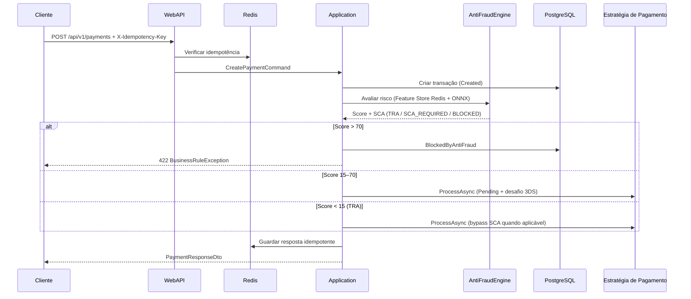

# HubPay — Hub de Pagamentos Pan-Europeu + Middleware IA Anti-Fraude

Documento de referência da solução: arquitetura, estado atual da implementação e trabalho pendente.

---

## 1. Visão geral

O **HubPay** é um hub de pagamentos interoperável para a União Europeia, alinhado com conceitos da **PSD3**, que orquestra esquemas domésticos (MB WAY, Bizum, Wero, iDEAL, etc.) e integra um **motor de anti-fraude inline** (sem chamadas I/O externas na inferência principal).

### Objetivos de performance (especificação)

| Componente | Meta |
|------------|------|
| Motor de IA (ONNX in-process) | ≤ 15 ms |
| Pipeline total da WebAPI | ≤ 45 ms (alta concorrência) |
| Timeout da inferência (Polly) | 12 ms antes do fallback |

---

## 2. Arquitetura da solução

A solução segue **Clean Architecture** com cinco projetos independentes:

```text
PaymentHUB/
├── HubPay.sln
├── docker-compose.yml          # PostgreSQL + Redis
├── SOLUCAO.md                  # Este documento
└── src/
    ├── HubPay.Domain           # Entidades, enums, exceções, interfaces
    ├── HubPay.Application      # CQRS (MediatR), DTOs, FluentValidation
    ├── HubPay.Infrastructure   # EF Core, Redis, ONNX, estratégias de pagamento
    ├── HubPay.WebApi           # Minimal APIs, middlewares, Serilog
    └── HubPay.Frontend.Blazor  # Dashboard AdminLTE 3 (Blazor WASM)
```

### Fluxo principal de um pagamento



### Dependências entre camadas

```text
WebApi  →  Application  →  Domain
              ↑
Infrastructure (implementa interfaces do Domain)
```

---

## 3. Stack tecnológica

| Camada | Tecnologia |
|--------|------------|
| Runtime | .NET 9 (C# 13) |
| API | ASP.NET Core Minimal APIs |
| CQRS | MediatR |
| Validação | FluentValidation |
| Base de dados | Entity Framework Core 9 + PostgreSQL |
| Cache / Feature Store | StackExchange.Redis |
| IA | Microsoft.ML.OnnxRuntime (in-process) |
| Resiliência | Polly (retry, circuit breaker, timeout) |
| Logs | Serilog |
| Frontend | Blazor WebAssembly + AdminLTE 3 (CDN) |

---

## 4. O que já foi implementado

### 4.1 HubPay.Domain

- [x] Entidade `Transaction` com máquina de estados e regras de transição
- [x] Enum `TransactionStatus`: Created, Pending, AntiFraudEvaluating, BlockedByAntiFraud, Authorized, Settled, Refunded, Failed
- [x] Exceções de domínio: `DomainException`, `BusinessRuleException`
- [x] Modelos: `PaymentResult`, `WebhookResult`, `RefundResult`, `AntiFraudEvaluationResult`
- [x] Interfaces: `ITransactionRepository`, `IPaymentStrategy`, `IPaymentStrategyFactory`, `IAntiFraudEngine`, `IAntiFraudAuditStore`
- [x] Configuração tipada: `HubPaySettings` (connection strings, APIs fake, caminho ONNX, taxa do hub)

### 4.2 HubPay.Application

- [x] Comandos: `CreatePaymentCommand`, `RefundPaymentCommand`
- [x] Queries: transações paginadas, estatísticas do dashboard, detalhe anti-fraude
- [x] Handlers MediatR para todos os comandos/queries
- [x] Validador FluentValidation (`CreatePaymentCommandValidator`) — montante > 0, moeda EUR, esquemas suportados
- [x] Pipeline `ValidationBehavior` para validação automática antes dos handlers
- [x] DTOs de request/response para API e frontend

### 4.3 HubPay.Infrastructure

#### Persistência
- [x] `HubPayDbContext` (Code-First) + `TransactionRepository`
- [x] Índice único em `EndToEndId`

#### Redis
- [x] Feature Store: contagem por `DeviceFingerprint` (5 min), países por `CustomerEmail` (1 h)
- [x] `RedisAntiFraudAuditStore` — auditoria das avaliações IA por transação

#### Anti-fraude
- [x] `AntiFraudEngine` com enriquecimento paralelo via Redis
- [x] Inferência ONNX quando o ficheiro existe; caso contrário, modelo matemático local
- [x] Regras PSD3 TRA: score &lt; 15 → `TRA`; 15–70 → SCA; &gt; 70 → bloqueio
- [x] Polly: timeout 12 ms + circuit breaker + fallback (Amount &lt; 30 EUR + histórico limpo → aprova; senão exige SCA)

#### Estratégias de pagamento (Strategy Pattern)
| País / região | Classe | Esquema |
|---------------|--------|---------|
| Portugal | `MBWayStrategy` | MB WAY (SIBS simulado) |
| Portugal | `MultibancoStrategy` | Referência + entidade (check-digit mod 97) |
| Espanha | `BizumStrategy` | Bizum |
| Espanha | `Euro6000Strategy` | Cartões débito locais |
| DE / FR (EPI) | `WeroStrategy` | SEPA Instant / A2A |
| França | `CartesBancairesStrategy` | Cartes Bancaires |
| Países Baixos | `IDealStrategy` | iDEAL (URL + QR) |
| Bélgica | `BancontactStrategy` | App-to-App / Web |
| Itália | `BancomatPayStrategy` | Bancomat Pay |
| Escandinávia | `SwishStrategy`, `VippsMobilePayStrategy` | Liquidação imediata |

- [x] `HttpClient` por estratégia com Polly (retry + circuit breaker)
- [x] `PaymentStrategyFactory` — resolução por nome do esquema
- [x] Webhooks genéricos por esquema

#### Reconciliação financeira
- [x] `FinancialClearingEngine` (`BackgroundService`) — ciclo a cada 30 s
- [x] Parse simulado de extrato **ISO 20022 camt.053.001.08**
- [x] Match por `EndToEndId`, liquidação com taxa de **0,8%**

### 4.4 HubPay.WebApi

- [x] Minimal APIs em `/api/v1`
- [x] `IdempotencyMiddleware` — header obrigatório `X-Idempotency-Key`, estados `IN_FLIGHT` / cache / `409`
- [x] `ExceptionHandlingMiddleware` — RFC 7807 (`ProblemDetails`): 400, 422, 500
- [x] Serilog estruturado
- [x] CORS para o frontend Blazor
- [x] `EnsureCreatedAsync` em desenvolvimento
- [x] Endpoint `/health`

**Endpoints disponíveis:**

| Método | Rota | Descrição |
|--------|------|-----------|
| POST | `/api/v1/payments` | Criar pagamento (idempotente) |
| GET | `/api/v1/transactions` | Listagem paginada |
| GET | `/api/v1/dashboard/stats` | Métricas do dashboard |
| GET | `/api/v1/transactions/{id}/antifraud` | Relatório da IA |
| POST | `/api/v1/transactions/{id}/refund` | Reembolso |
| POST | `/api/v1/webhooks/{scheme}` | Webhook por esquema |

### 4.5 HubPay.Frontend.Blazor

- [x] Layout AdminLTE 3 (CSS/JS via CDN)
- [x] `Dashboard.razor` — small-boxes (volume, conversão, fraudes, TRA) + gráfico Wero vs cartões
- [x] `Transactions.razor` — tabela paginada com país, esquema, estado, score
- [x] `AntiFraudDetail.razor` — inputs ONNX, score, tempo em ms, botão de reembolso
- [x] `HubPayApiClient` — consumo assíncrono da WebAPI

### 4.6 Infraestrutura local

- [x] `docker-compose.yml` com PostgreSQL 16 e Redis 7
- [x] Solução compila sem erros (`dotnet build HubPay.sln`)

---

## 5. Como executar (desenvolvimento)

### Pré-requisitos

- .NET 9 SDK
- Docker (opcional, para PostgreSQL e Redis)

### Passos

```powershell
cd c:\Development\PaymentHUB

# 1. Subir dependências
docker compose up -d

# 2. API (terminal 1)
dotnet run --project src/HubPay.WebApi

# 3. Frontend (terminal 2)
dotnet run --project src/HubPay.Frontend.Blazor
```

### URLs padrão

| Serviço | URL |
|---------|-----|
| WebAPI | `https://localhost:7239` |
| Blazor | conforme `launchSettings.json` do projeto WASM |
| Health | `https://localhost:7239/health` |

### Exemplo de pedido de pagamento

```http
POST https://localhost:7239/api/v1/payments
X-Idempotency-Key: chave-unica-001
Content-Type: application/json

{
  "merchantId": "MERCH-PT-001",
  "amount": 25.50,
  "currency": "EUR",
  "paymentScheme": "MBWAY",
  "endToEndId": "E2E-20260518-001",
  "customerIP": "185.12.34.56",
  "deviceFingerprint": "fp-abc-123",
  "customerEmail": "cliente@example.pt",
  "countryCode": "PT"
}
```

### Configuração

Ficheiros principais:

- `src/HubPay.WebApi/appsettings.json` — `HubPay:ConnectionString`, Redis, APIs, ONNX
- `src/HubPay.Frontend.Blazor/wwwroot/appsettings.json` — `ApiBaseUrl`

---

## 6. O que ainda falta fazer

Itens necessários ou recomendados para **produção** ou para cumprir integralmente a especificação original.

### 6.1 Crítico (produção)

| Item | Estado | Notas |
|------|--------|-------|
| Modelo ONNX real (`Models/antifraud.onnx`) | ❌ Pendente | Sem ficheiro, usa modelo matemático + fallback; é preciso treinar/exportar ONNX com input `input` shape `[1,4]` |
| Migrations EF Core | ❌ Pendente | Hoje usa `EnsureCreatedAsync`; em produção usar `dotnet ef migrations` |
| Autenticação / autorização (API + Blazor) | ❌ Pendente | Sem JWT, API keys de merchant ou OAuth2 |
| HTTPS e secrets | ❌ Pendente | Chaves em Azure Key Vault / User Secrets; não commitar credenciais reais |
| Testes automatizados | ❌ Pendente | Unitários (domínio, mod97, estados), integração (API + Testcontainers PostgreSQL/Redis) |
| CI/CD | ❌ Pendente | Pipeline build, test, deploy |

### 6.2 Integrações reais com PSPs

| Item | Estado | Notas |
|------|--------|-------|
| SIBS (MB WAY / Multibanco) | ⚠️ Simulado | HTTP com fallback local em erro de rede |
| Bizum, Wero, iDEAL, etc. | ⚠️ Simulado | Payloads JSON de exemplo; sem certificados mTLS reais |
| Assinatura / validação de webhooks | ❌ Pendente | HMAC ou certificados por PSP |
| Idempotência no lado do PSP | ❌ Pendente | Alinhar com especificações de cada adquirente |

### 6.3 Anti-fraude e compliance

| Item | Estado | Notas |
|------|--------|-------|
| Benchmark de latência (&lt;15 ms / &lt;45 ms) | ❌ Pendente | Testes de carga (k6, NBomber) e métricas APM |
| Application Insights / OpenTelemetry | ❌ Pendente | Traces por transação, latência do ONNX |
| Listas de sanções / PEP (AML) | ❌ Pendente | Não incluído no scope atual |
| Auditoria regulatória (TRA) persistente | ⚠️ Parcial | Redis 7 dias; considerar tabela dedicada em PostgreSQL |
| 3D Secure / PSD2 SCA real | ⚠️ Parcial | Payload de desafio simulado; sem integração ACS real |

### 6.4 Reconciliação e back-office

| Item | Estado | Notas |
|------|--------|-------|
| Ingestão real de ficheiros camt.053 | ❌ Pendente | Hoje gera XML simulado em memória |
| SFTP / bucket para extratos bancários | ❌ Pendente | — |
| Relatórios de disputas / chargebacks | ❌ Pendente | — |
| Multi-tenant (vários merchants) | ⚠️ Parcial | `MerchantId` existe; sem isolamento por tenant na BD |

### 6.5 Frontend

| Item | Estado | Notas |
|------|--------|-------|
| AdminLTE local (offline) | ⚠️ CDN | Dependência de rede; opcional empacotar assets |
| Gráficos avançados (Chart.js / ApexCharts) | ⚠️ Básico | Barras CSS simples no dashboard |
| Atualização em tempo real (SignalR) | ❌ Pendente | Monitor transacional não é live ainda |
| Internacionalização (i18n) | ❌ Pendente | UI em português fixo |
| Formulário de criação de pagamento na UI | ❌ Pendente | Apenas leitura via API externa |

### 6.6 Qualidade de código e operações

| Item | Estado | Notas |
|------|--------|-------|
| README de contribuição | ⚠️ Este doc | — |
| `.editorconfig` / analisadores estritos | ❌ Pendente | — |
| Health checks (PostgreSQL, Redis, ONNX) | ⚠️ Parcial | Apenas `/health` simples |
| Rate limiting por merchant | ❌ Pendente | — |
| Dead letter / fila para webhooks falhados | ❌ Pendente | — |

---

## 7. Roadmap sugerido (prioridade)

1. **Migrations EF + modelo ONNX** — base estável de dados e IA real  
2. **Testes + benchmarks de latência** — validar metas de 15 ms / 45 ms  
3. **Autenticação da API** — proteger endpoints mutáveis  
4. **Primeira integração real** (ex.: SIBS sandbox MB WAY) — substituir simulação  
5. **SignalR no monitor de transações** — dashboard operacional em tempo real  
6. **Ingestão camt.053 real** — reconciliação bancária de produção  
7. **CI/CD + observabilidade** — deploy e monitorização contínua  

---

## 8. Estrutura de pastas relevante (código)

```text
src/HubPay.Domain/
  Entities/Transaction.cs
  Enums/TransactionStatus.cs
  Interfaces/
  Configuration/HubPaySettings.cs

src/HubPay.Application/
  Commands/  Queries/  Handlers/
  Validators/  Behaviors/  DTOs/

src/HubPay.Infrastructure/
  AntiFraud/AntiFraudEngine.cs
  Clearing/FinancialClearingEngine.cs
  Payments/Strategies/*.cs
  Persistence/  Redis/

src/HubPay.WebApi/
  Middleware/  Endpoints/  Program.cs

src/HubPay.Frontend.Blazor/
  Pages/Dashboard.razor
  Pages/Transactions.razor
  Pages/AntiFraudDetail.razor
  Services/HubPayApiClient.cs
```

---

## 9. Resumo executivo

| Área | Progresso estimado |
|------|-------------------|
| Arquitetura e projetos | ✅ Completo |
| Domínio e CQRS | ✅ Completo |
| API e middlewares | ✅ Completo (sem auth) |
| Anti-fraude inline | ⚠️ Funcional com fallback (sem ONNX treinado) |
| Esquemas de pagamento EU | ⚠️ Estrutura completa, integrações simuladas |
| Reconciliação ISO 20022 | ⚠️ Motor simulado |
| Dashboard Blazor | ✅ MVP operacional |
| Produção / compliance | ❌ Maioria pendente |

A solução está **pronta para desenvolvimento e demonstração end-to-end** (API + dashboard + Docker), mas **não está pronta para produção regulada** sem concluir os itens da secção 6.

---

*Última atualização: maio de 2026 — alinhado com o estado do repositório PaymentHUB.*
